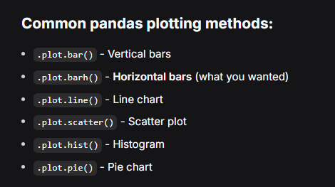
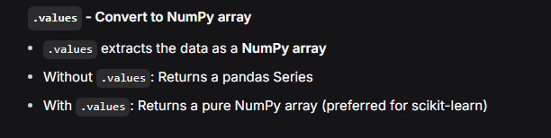
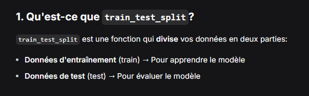
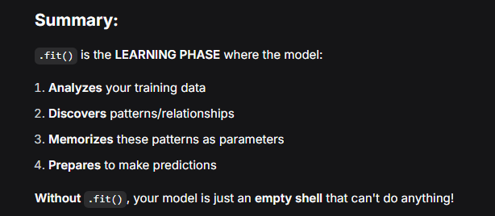
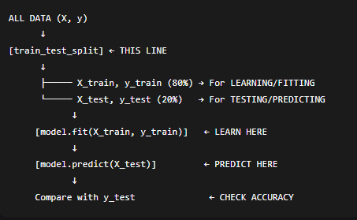

# Machine-learning
**Seaborn** is a statistical data visualization library built on top of Matplotlib.
 It provides a high-level interface for drawing attractive and informative statistical graphics. It simplifies the process of creating complex visualizations.  
 **Statsmodels** is a library for statistical modeling and econometrics.
It provides classes and functions for the estimation of many different statistical models, as well as for conducting statistical tests and data exploration.
Example use: Running regression analyses, time series analysis, and hypothesis testing.  
**Scikit-learn** is a machine learning library for Python.
It provides simple and efficient tools for data mining and data analysis, including classification, regression, clustering, and dimensionality reduction.
Example use: Building and evaluating machine learning models, such as decision trees, support vector machines, and k-means clustering.

**datasets** (from sklearn)

It's a A submodule of Scikit-learn that provides access to small standard datasets.
It’s useful for testing and learning machine learning algorithms without needing to load large datasets from external sources.
Example use: Loading the Iris dataset for classification tasks.  
**1. fetch_california_housing()**

This is a function from sklearn.datasets that downloads and returns the California Housing dataset.
The dataset contains features like median income, house age, etc., and the target variable is the median house value for districts in California.
When you call this function, it returns a dictionary-like object (housing) with several attributes, including:

`housing.data:` This is a NumPy array containing the feature values for all samples in the dataset. It’s a 2D array where each row represents a sample, and each column represents a feature.  
The feature matrix (a 2D array of shape (n_samples, n_features)).  
`housing.target:` The target values (a 1D array of shape (n_samples,)).  
`housing.feature_names:` This is a list of strings representing the names of each feature in the dataset.
The names of the features (e.g., ['MedInc', 'HouseAge', ...]).
housing.DESCR: A description of the dataset.




# .fit() = LEARN/TRAIN
model.fit(X_train, y_train)
# "Study these examples and find patterns"

# .predict() = USE KNOWLEDGE
predictions = model.predict(X_test)
# "Use what you learned to answer new questions"

---
 ### polinomila regression :
 Step 1: SPLIT (This line)
```python
X_train, X_test, y_train, y_test = train_test_split(X, y, test_size=0.2)
```
# Just divides data into 2 groups
Step 2: CREATE MODEL
```python
model = LinearRegression()  # Get empty model
```
Step 3: FIT/TRAIN (Learn from TRAINING data)
```python
model.fit(X_train, y_train)  # LEARN from X_train, y_train
```
Step 4: PREDICT (Test on TESTING data)
```python
predictions = model.predict(X_test)  # PREDICT on X_test
```
Step 5: EVALUATE
```python
# Compare predictions with REAL answers (y_test)
accuracy = model.score(X_test, y_test)
```
SimpleImputer is a tool from scikit-learn that automatically fills in missing values (NaN) in your data.
How it works:
Instead of manually filling missing values, **SimpleImputer** does it for you using different strategies:
pythonfrom sklearn.impute import SimpleImputer
```python
# Create an imputer that fills missing values with the median
imputer = SimpleImputer(strategy='median')

# Learn the median from training data and fill missing values
X_train = imputer.fit_transform(X_train)

# Use the SAME median from training data to fill test data
X_test = imputer.transform(X_test)
```